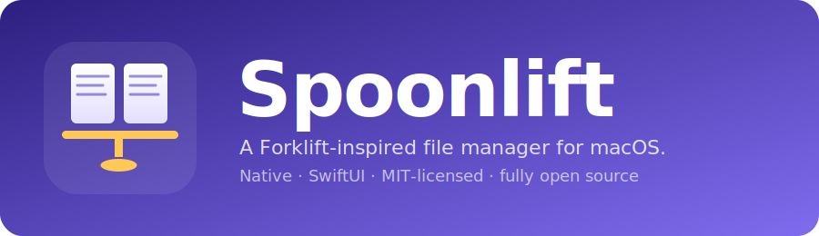

<p align="center">
  
</p>

<p align="center">
  <a href="LICENSE"></a>
  
  
  <a href="../../releases/latest"></a>
</p>

**Spoonlift** is a native macOS file manager heavily inspired by Forklift — dual-pane browsing, tabs, four view modes, Finder tags, Quick Look, drag-drop transfers with progress. Built in SwiftUI. Fully open source. MIT licensed.

> Not affiliated with BinaryNights / Forklift. Functional inspiration only — code and visual identity are original.

---

## ✨ Features

- **Dual pane**, split side-by-side. Add or close panes on the fly.
- **Tabs per pane** (`⌘T` new, `⌘W` close, `⇧⌘T` new pane).
- **Four view modes** — List · Icons · Columns (miller) · Brief.
- **Sidebar** — Favorites · Locations · Devices (with ⏏ eject) · Tags.
- **Finder tags** — read *and* write: colored dots in every view, tag submenu in the context menu.
- **Rich right-click menu** — Open, Open With ▸, Open in New Tab, Open in Other Pane, Quick Look, Get Info, Copy, Cut, Paste Items, Duplicate, Rename, Compress, Copy Path, Add to Favorites, Tags ▸, Move to Trash. Right-click empty space for New Folder, Paste, Sort By ▸, View As ▸, Open in Terminal, Refresh.
- **Drag & drop** between panes — plain drop = copy, `⌘`-drop = move. Transfer window shows progress, and a conflict dialog lets you Replace / Skip / Keep Both, with an "apply to all" toggle.
- **Quick Look** on `␣`, plus a toggleable **inline preview pane** per tab.
- **Session restore** — windows, panes, tabs, URLs, view mode, and sort survive quits.
- **Multi-window** (`⌘N`) and per-window undo for trash.

## 📥 Install

### Download the DMG

1. Grab the latest `Spoonlift-x.y.z.dmg` from the [Releases page](../../releases/latest).
2. Open it and drag **Spoonlift** to `Applications`.
3. First launch: the app is ad-hoc signed (no Apple Developer ID yet), so macOS Gatekeeper will block it by default. Either:
   - Right-click the app → **Open** → confirm once, **or**
   - Run once in Terminal: `xattr -d com.apple.quarantine /Applications/Spoonlift.app`

Requires **macOS 14 Sonoma** or newer.

## 🛠 Build from source

Great for contributors or anyone who wants the bleeding edge.

**Prerequisites:**
- macOS 14+
- Xcode 15+
- [xcodegen](https://github.com/yonaskolb/XcodeGen) (`brew install xcodegen`)

```bash
git clone https://github.com/KillianG/open-forklift.git
cd spoonlift
xcodegen                    # generates Spoonlift.xcodeproj from project.yml
open Spoonlift.xcodeproj
```

Hit **⌘R** in Xcode.

To produce a distributable `.dmg` yourself:

```bash
scripts/build-release.sh 0.1.0
# output: build/Spoonlift-0.1.0.dmg
```

See [`CONTRIBUTING.md`](CONTRIBUTING.md) for project layout, coding style, and how to cut a release.

## ⌨️ Keyboard shortcuts

| Shortcut | Action |
|----------|--------|
| `⌘N` | New window |
| `⌘T` | New tab in active pane |
| `⇧⌘T` | New pane |
| `⌘W` | Close tab (or pane if last tab) |
| `⌘[` / `⌘]` | Back / forward |
| `⌘↑` | Up one level |
| `␣` | Quick Look toggle |
| `⌥⌘I` | Toggle preview pane |
| `⇧⌘N` | New folder |
| `⌘C` / `⌘X` / `⌘V` | Copy / cut / paste items |
| `⌘D` | Duplicate |
| `⌘I` | Get Info |
| `⌥⌘C` | Copy path |
| `⌘⌫` | Move to Trash |
| `⌘Z` | Undo trash |
| `⇧⌘.` | Toggle hidden files |

## 📸 Screenshots

<!--
  Replace the links below with real captures once you have them.
  Contributor guide: docs/screenshots/README.md
-->

| Dual pane — light | Dual pane — dark |
|--|--|
|  |  |

| Columns view | Context menu |
|--|--|
|  |  |

| Transfer with progress | Finder tags |
|--|--|
|  |  |

## 🗺 Roadmap

- SFTP / FTP / SMB / WebDAV / S3
- Archive browsing (zip, tar, 7z)
- Folder sync & compare
- Preferences window
- Apple Developer ID signing + notarization
- Real icon artwork
- App Sandbox + security-scoped bookmarks

## 🙏 Inspiration & credits

Spoonlift's UX is unapologetically influenced by [Forklift](https://binarynights.com/) — the best-in-class dual-pane file manager for macOS. If you need remote protocols today, go buy it.

This project exists as a fully open-source, hackable alternative for the subset of Forklift most people use: **local** file management with a **dual-pane** workflow.

## 📄 License

[MIT](LICENSE). You can use, modify, and redistribute Spoonlift — including for commercial purposes — as long as the copyright notice stays in.
